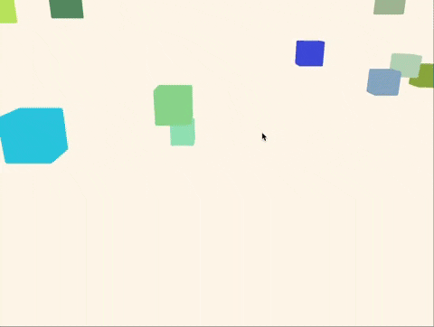

# voxel
This is a rubbish game engine made just for fun with a focus on learning more about the Rust language and game development. It integrates with ECS through [specs](https://github.com/amethyst/specs) and its physics happens through [rapier3d](https://rapier.rs/).  
Game samples are under `voxel/examples` folder.  

